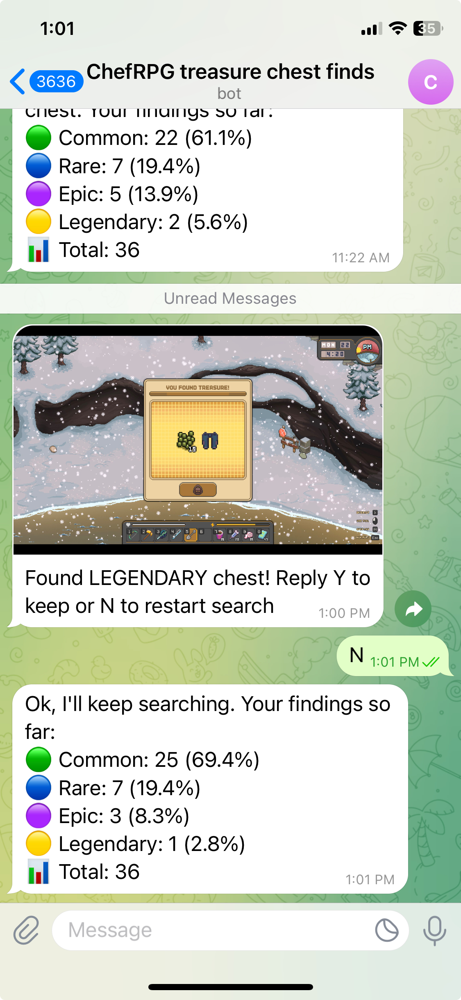

## Instructions

1. Find a treasure spot near a cave entrance/exit.
2. Equip your shovel, save and FORCE QUIT the game. This will be CMD+Q on Mac, and ALT+F4 on windows. (Do not exit via main menu)
3. Run the script after configuration

## Configuration

### Change the username

- This tool works by using image recognition. You need to update the [username screenshot](./images/username) to match your own

### Configure params

- Modify the [constants](./utils/constants.py) file.
- It will take some trial and error for the WALK_PATTERN parameter, but it should take fewer than 10 attempts.

## How to run

### Install deps

```
python3 -m venv .venv
. .venv/bin/activate
python3 -m pip install pyautogui opencv-python pillow numpy requests dotenv
```

### Run script

```
python3 search.py
```

## Logging

For every attempt at finding a treasure chest, it will be logged to the [chest_attempts.csv](./chest_attempts.csv) file.

## Telegram Bot API (Optional but recommended)

This tool is compatible with telegram bot API.
You can configure the types of chests you might want to keep in constants.py
When a chest with the specified rarity is found, the telegram bot will send you a message. You can then preview the contents, and choose to keep it or to discard it and restart the search.

By default, it waits up to 2 hours for a response. If there is no response, it assumes you may want to keep the items and stops the automation. Read more below on how to set it up.



### 🧠 Part 1: Create Your Telegram Bot

1. Open a chat with @BotFather in Telegram
   This is Telegram’s official bot for managing other bots.

2. Type /newbot and follow the instructions
   Choose a name for your bot (e.g., My Chef Bot)

   Choose a username for your bot, ending in bot (e.g., mychefrpg_bot)

3. Get your Bot Token.

   BotFather will return something like:

   ```
   Use this token to access the HTTP API:
   123456789:ABCdefGhIJkl-MNOPqrSTUVwxyZ
   ```

   That’s your Bot Token. This serves as your bot ID when making API calls.

### 📦 Part 2: Get Your Chat ID

You need to know the chat ID to send messages to a person or group.

How to get your personal chat ID

1. Start a chat with your bot (just send any message).
2. Open this URL in your browser (replace <YOUR_BOT_TOKEN> with your actual token):
   https://api.telegram.org/bot<YOUR_BOT_TOKEN>/getUpdates

Look for something like:

    "message": {
      "chat": {
        "id": 123456789,
        "first_name": "YourName",
        ...
      }
    }

That id (123456789) is your chat ID.

Copy and paste these into a `.env` file (You can duplicate and rename `.env.example` to `.env` and modify the values inside)

## FAQs

Q: Why is the script not able to click on a button or detect a certain kind of treasure chest?
A: pyautogui is pixel specific / device sensitive, so if the [images](./images/) folder doesn't contain screenshots specific to your device, it may not work as expected. You can modify these folders to include your own screenshots. Note that the larger the size of this folder, the longer the script will take to run.

Q: Why is it not working properly?
A: For attempts where no chests are found, a screenshot will be taken and saved to the [debug folder](./debug_screenshots/). If you see a chest in any of these screenshots, it means you need to update the screenshots of that particular chest.

Q: Why is it taking so long to identify the treasure chest?
A: You can optimize this by deleting all the files in each nested folder in [images](./images/). The script tries to match EACH image in this folder, so you can replace these screenshots with your own. When you take screenshots, try to ensure that the background doesn't get captured as well. For example, for the continue button, just take a screenshot of what's inside the button's borders. This will prevent it trying to match the background (There are a variety of loading screen backgrounds)

